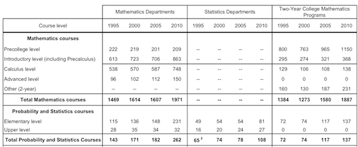

Exercises: Week 2
=======================

```{r include=FALSE}
require(DCF)
```

### Exercise 1

The table below was published as part of the [CBMS survey](http://www.ams.org/profession/data/cbms-survey/cbms) of college-level mathematics enrollment in the US.  Like many published tables intended for the human reader it does not follow the strict case/variable format.



Create a new Google Spreadsheet that contains the information from the table.  Here's a stub of a table to show you one possible format.  Make sure not to include the "totals" in your data table.  Those are quantities that can be determined from the other data in the table.

Field | Subject | Organization | Year | Enrollment
------|---------|--------------|------|------------
Math  | Precollege | Math Dept | 1995 | 222
Math  | Introductory | Math Dept | 1995 | 613

* Levels for **Field**: Math, Stats
* Levels for **Year**: 1995, 2000, 2005, 2010
* Levels for **Subject**: Precollege, Introductory, Calculus, Advanced, Other, Elementary, Upper
* Levels for **Organization**: Math Dept, Stat Dept, Two-Year


Read in your spreadsheet.  Make sure that you haven't made any mistakes in your entries for the different variables: the levels should match those given above.

**(1.a)** Use `subset` to select out the cases that correspond to the total 1469 given in the table.  Verify that this total is correct. 

**(1.b)** Use `subset` and `groupBy` to confirm the totals 1384, 1273, 1580, 1887

**(1.c)** Find the total enrollments in each year.

**(1.d)** Find the total enrollments in each year, broken down by Field

**(1.e)** Find the total enrollments in each year, broken down by Subject (lumping all the organizations together)

------------

### Exercise 2

Making barplots from the enrollment data to illustrate each of these matters ...

**(2.a)** How enrollment differs between math departments and two-year colleges in each of the different subjects.

**(2.b)** How the fraction of overall enrollments in pre-college and pre-calculus math has changed over the years


------------

### Exercise 3
Using the `FAOsimple` data ...

**(3.a)** Find the total population of women in the world.

**(3.b)** Find the total population of women in countries where women outnumber men and where men outnumber women.

**(3.c)** Find the total population of women in countries where the urban population exceeds the agricultural population.


