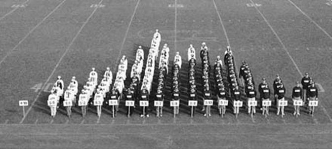

Week 2 Notes
==================

Syntax problems from week 1.  Examples in this [email](https://mail.google.com/mail/u/0/?shva=1#inbox/13d12da9523743c3)

Example of a stacked bar chart in the pre-computation days.

 

> Photograph by Peter Morenus in conjunction with Professor Linda Strausberg, University of Connecticut.  Subjects are University of Connecticut genetics students, females in white tops, males in dark tops.