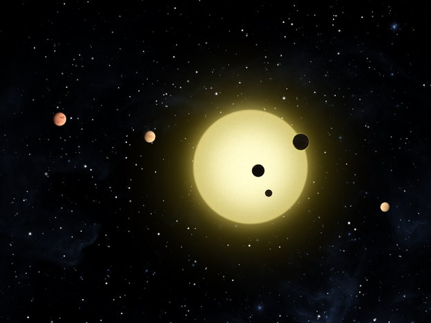
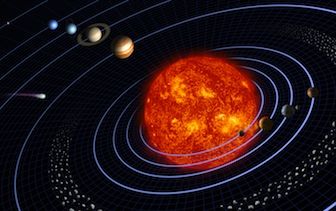

## Is This What Solar Systems Look Like?

```{r include=FALSE}
require(mosaic)
```

Here is an illustration, provided by NASA, of the kind of solar systems that have been identified by the [Kepler-11 probe](http://kepler.nasa.gov/Mission/discoveries/)



You have probably seen pictures like this, but with the planets in our solar system.



[source](http://solarsystem.nasa.gov/multimedia/gallery/SSE_Grid.jpg)

Or, a mechanical model, called an [orrery](http://en.wikipedia.org/wiki/Orrery)


Perhaps you realize that these depictions are schematic.   The planets' orbits are further apart than shown.  We can get [quantitative data](http://btc.montana.edu/ceres/html/Weight/weightsolardata.htm) on the planet sizes and orbital distances from the sun, showing more or less what a probe on the edge of the solar system might capture.

Links to physical models [earth as peppercorn](http://www.noao.edu/education/peppercorn/pcmain.html)
     
Earth's radius: 6378.1 km

Earth orbit radius: 149597870 km

Planet,Diameter,OrbRadius 
Mercury 0.39, 4.6
Venus 0.97, 8.66
Earth 1.0, 12.0
Mars 0.54, 18.2
Jupiter 11, 62.3
Saturn 9.7, 115
Uranus 4.1, 230
Neptune 4.0, 360
Pluto 0.19, 470
Sun,109,0

Link to [teachers' guide](http://solarsystem.nasa.gov/docs/voyagescalemodelss.pdf)

Planet diameters are in mm, orbital radii in meters
poppy seed, sesame seed, sesame,poppy,penny,penny,peppercorn,poppy,small orange

A proportional model:
```{r}
ss <- read.csv('solarSystem.csv')
xyplot( I(0*Distance) ~ Distance, data=ss,pch=20,cex=.00002*(6378.1/14959.7870)*ss$Radius,col=rgb(.4,.4,0,.2))
```
We can't see the planets.

```{r}
xyplot( I(0*Distance) ~ Distance, data=ss,pch=20,cex=.2*(6378.1/14959.7870)*ss$Radius,col=rgb(.4,.4,0,.2))
```
The scale for the planets is roughly 10000 times larger than the scale for distance between planets.  

With a log scale:
```{r}
xyplot( I(0*Distance) ~ log(Distance), data=ss,pch=20,cex=(6378.1/14959.7870)*ss$Radius)
```

Try it with a rank scale:
```{r}
xyplot( I(0*Distance) ~ rank(Distance), data=ss,pch=20,cex=.2*(6378.1/14959.7870)*ss$Radius)
```

```{r}
xyplot( I(0*Distance) ~ rank(Distance)*log(Distance), data=ss,pch=20,cex=(6378.1/14959.7870)*ss$Radius)
```


And a square-root scale:

```{r}
xyplot( I(0*Distance) ~ sqrt(Distance), data=ss,pch=20,cex=.5*(6378.1/14959.7870)*ss$Radius)
```

Redo this in ggplot2.  Or, maybe, you'll have to do a circle and a polygon at each planet and the sun.


Find a color scale for the temperature.