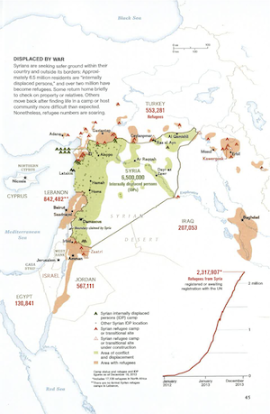

# Notes for redoing the Syrian refugee map

From National Geographic, January 2014



A Department of State web site containing shapefiles and other data. [link](https://hiu.state.gov/data/data.aspx)

[Other shapefiles](http://www.gadm.org/)

Idea: put the data on the countries, population and refugee population, latitude and longitude of centroid, and draw a scatter plot with circle size representing population, intensity representing refugees/population, and maybe an inner circle showing the number of refugees.  Maybe for the Syria circle, put a blank smaller circle for each of the receiving countries and a filled circle for the internal refugees in Syria.

Making networks with `igraph`.  Here's an example showing how to change size and color of the vertices and edges.

```{r}
require(igraph)
require(mosaic)
plot(graph.tree(20,2,mode="undirected"),vertex.size=runif(20,10,30),vertex.shape="square",vertex.color=resample(c("red","blue","green"),size=20),edge.width=runif(20,1,20))
```

You can give a matrix of x,y coordinates for the layout, or use one of the automatic layout functions.

