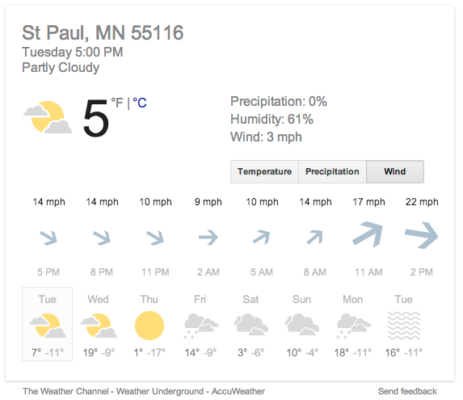

## For Parsing Graphics

Here is a graphic about weather in Saint Paul, Minnesota during the week of February 24-March 2.

1. What is the frame?  Is there more than one frame?  
Ans: Two frames.  One is time by day.  Above that is time (today) by hour. 
2. What guides are there?  
Ans: One gives the day of the week.  The other gives the time of day (for the current day).  There are also guides giving the location (St. Paul
3. How many different forms of glyph are there?  
Ans: Two graphical glyphs.  Also some numeric and text information.  
4. How does each glyph encode multiple quantities?  
Ans: The cloud and sun one which encode the extent to which the sky is overcast as well as the precipitation.  The arrow one presents wind direction as the vector direction (presumably on a conventional NESW compass), and wind velocity as the thickness of the arrow.  There are also numerical an

Incidentally, this graphic was created at 5:40 on the first Tuesday.  The wind listed in the glyph says 14 miles per hour, but the actual wind is given as 3 miles per hour.  