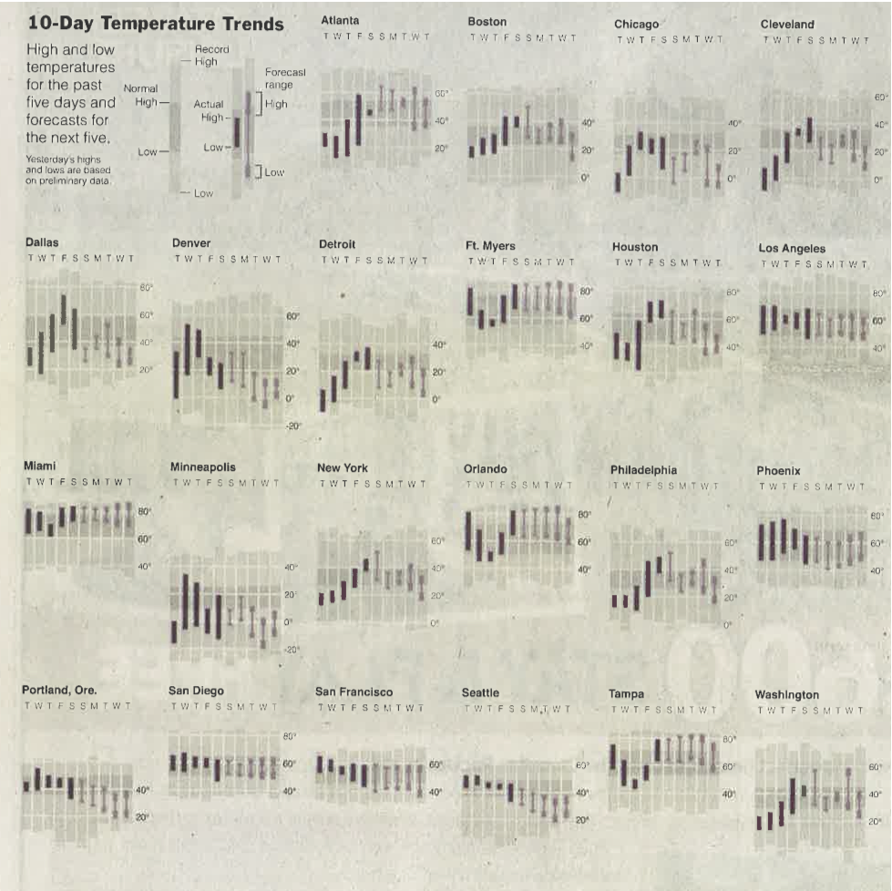
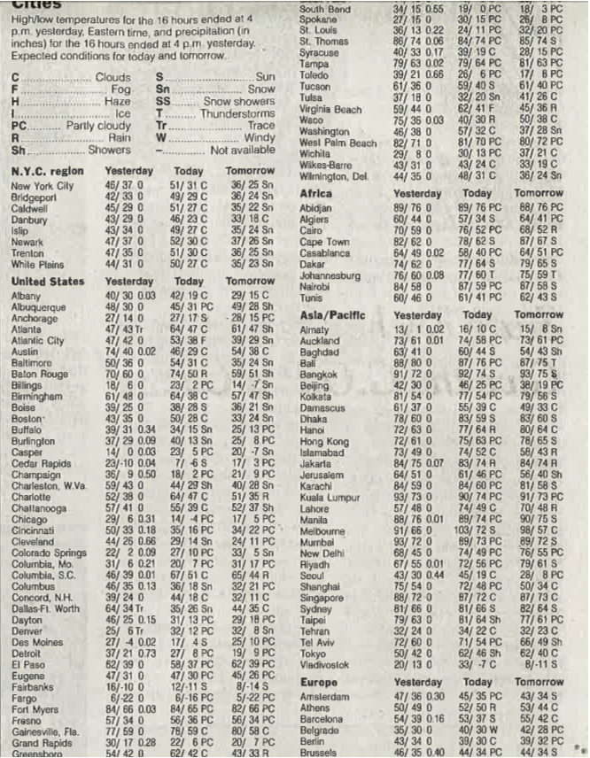

# Weather Example

Graphics Source: New York *Times* Feb 2, 2014, p.16

## Exercise

This graph from the New York *Times* summarizes 10-day weather trends around the country.

1. Look carefully at the key and the graph panel for one city.  Based on this, explain what variables are included in the graph and how they are encoded graphically.
2. Other than the data being presented, what aspects of the graph help or hinder its informativeness?

### Answer

* Day: Horizontal axis for each panel
* Normal high: top of the light gray bar for each day
* Normal low: bottom of the light gray bar
* Actual high: top of the darker bar for each day
* Actual low: bottom of the darker bar
* Forecast high
    * high estimate
    * low estimate
    Top bar of the barbell-shaped element
* Forecast low: 
    * high estimate
    * low estimate
    Bottom bar of the barbell shaped element

Helpful aspects of the graph:
* The vertical scale is shown using very light bars that don't interfere visually with the weather data.
* It's easy to compare the actual and normal weather and the forecast and normal weather, since they are plotted on top of one another.
* The cities (in each row) are arranged on a common vertical axis.
* The actual and forecast weather are presented in easily distinguishable forms that make intuitive sense: a solid, dark bar for the actual weather and a lighter format for the forecast. 

## Tables of Data

Sometimes it's appropriate to present "raw" data in tabular form.  This is particularly the case if the reader's interest is to examine cases individually rather than comparing cases to one another.  The topology here --- by continent and then alphabetically within each continent --- make it easy to find a particular city.

