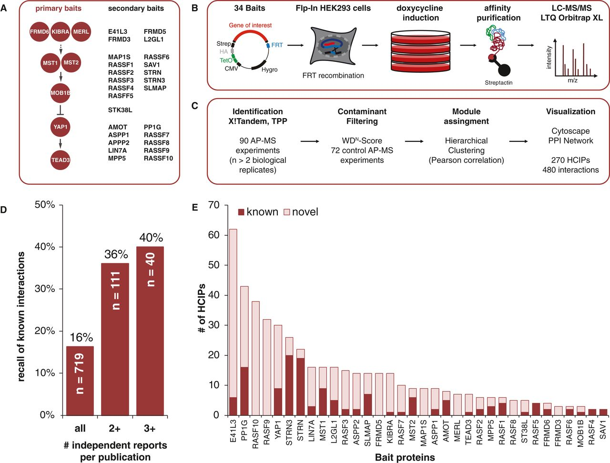
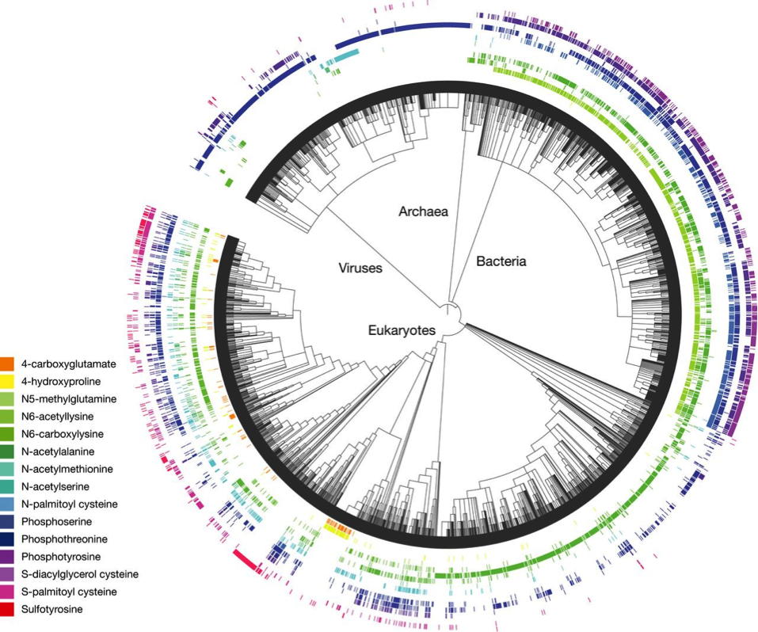
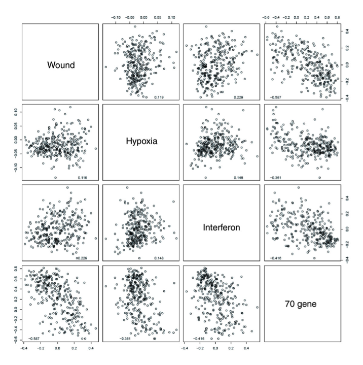

# Parsing Graphics

## Generic Form

Questions to ask about graphics:
* What is the glyph? 
* What is a "case."  Is it a physical entity?  Is it a collective property of multiple entities, e.g. a count of individuals matching a criterion.
* (Are there more than one graphical entity, e.g. lines connecting cases, models, smoothers, ...?)
* Are there facets?  What do they stand for?
* What does position mean?  Is there a coordinate system?  One or two axes? Typically, there will be two components to position. Exception: Parallel coordinates.
    * Where is zero?  Is zero meaningful?
    * Scale and transformation, e.g. log.
    * Is position representing a categorical variable or a quantitative variable?
    * Categorical to position.  How is order being used?
* What does the individual glyph mean?  Color, shape, size, slope, length, contours, ...
* What is being encoded by the collective summary?  Density, spread, center, group membership

From `graphicalPresentations.Rmd`

## Weight Loss and Cancer

Headline: Weight loss may change adipose tissue biology, lowering cancer risk

[site](http://www.fhcrc.org/en/news/spotlight/imports/weight-loss-may-change-adipose-tissue-biology--lowering-cancer-r.html)

Caption: Differential gene expression, by weight change. Heat map displaying changes in expression of prespecified genes over 6 months in individuals with no weight loss, compared to those with <5%, 5>–10%, and >10% weight loss. Gradients indicate the level of gene expression change over time. Figure modified from campbell k l et al. cancer prev res 2013;6:217-231

* What's the glyph?  Constant size rectangular box shaded in a color.
* What's the case? Gene expression change for a particular candidate gene for an individual participant.
* What's the back data?  Separate measurements of expression before and after weight change.
* What's the glyph stand for?  
    Light red means positive change in expression, light green is a negative change.
* Are there axes?  What's the order along an axis?
    * vertical axis is the individual gene.
    * horizontal axis is an individual person.  The people are ordered by the amount of their weight loss.
* Criticisms: 
    * color scale mixes hue and luminance. 
    * the individual person isn't a particularly important value. The important outcome is encoded as color --- hard to intuit the scale.
    * Maybe better to graph expression change versus weight loss, coding the different genes as different symbols or on different facets.
    
## Interaction proteome of human Hippo signaling    

(Link to article)[http://msb.embopress.org/content/9/1/713]

Panel E

* The case: a protein
* The glyph: a segmented bar
* y axis: Number of HCIPs
* x axis: Protein ordered by total number of HCIPs
* glyph meaning:  length of segment encodes number.  Color indicates how many are known versus novel.

## Molecular cladistics

Source unknown.  This was the first of the graphics in Andy Zieffler's `Bio-Visualizations.docx`

A combination of two graphic modes.

### Expression

Expression (?) of various molecules by different organisms.

* Glyph: a thin colored bar
* Case: expression of a molecule by an organism
* Glyph meaning: color identifies the molecule, saturation the level (?) of expression.
* Axes:
    * Radial --- the molecule type --- redundant with color.  Order appears to be alphabetical, with numbers favored over characters (e.g. `N6-` preceeds `N-`)
    * Circumferential: organism type, arranged by clade. The rough order is biological kingdom (Archaea, Bacteria, Eukaryotes, Viruses).  Order within the kingdom is arbitrary.  Order among the kingdoms seems alphabetical
    
### Cladistics

A heirarchical clustering dendrogram based on (?).

* Glyph: tree
* Case: an organism or an inferred clade
* Axes:
    * Radial: where the clades join in some distance metric
    * Circumferential: branches of the trees.
    
#### Criticisms

* The labels (e.g. "Bacteria") are not visually closely associated with the corresponding organism. The branch between Bacteria and Eucaryotes (at about 4 o'clock) isn't identified).
* The number of organisms is arbitrary, so lengths along the circumference don't mean anything.
* Position and color used for the same thing.
* The circular format is not directly used.  It does serve to put the tree into a small space.  Early clades are in the center of the circle, so they don't take much space visually.
* There is a gap in the circle between viruses and eukaryotes, and there should be similar gaps between the other kingdoms.
* Within a clade, order is arbitrary.  Really there are just four or five types (four are labelled, the one at 4 o'clock makes a fifth).  Why not emphasize the difference between those kingdoms, perhaps as a parallel coordinate plot.  Except at the highest level (kingdom), the cladistics doesn't do much.

## Expression of Genes (?) in different conditions

Source (?): Buess et al. Genome Biology 2007 8:R191   doi:10.1186/gb-2007-8-9-r191.  From Andy Ziefflers `Bio-Visualizations.docx`

Matrix scatter plot.

Facet: which of the two conditions
x-axis: expression level (quantitative)
y-axis: expression level (quantitative)
glyph: dot

Criticisms:
* If point is the relationship or lack thereof between conditions and gene expression, perhaps show a smoother with error bands to signal the evidence for the relationship.
* Distribution inhomogeneity makes it hard to eyeball correlation: the shape of the cloud often reflects just the single-variate distribution.
* Just one correlation seems there: Wound vs 70 gene
* How about a parallel axes plot, with one axis for expression in each condition and the line color being the gene.

## Probability field

The visualization of the linguistic survey results [on the shiny server](http://www.rstudio.com/shiny/showcase/)

This is an interactive map.

As a collective properties graph, the individual cases are not being graphed, nor are pairs.  Instead, all the cases in a locale are summarized, with the summary being displayed.  The summary is very smooth because changing the locale by a little doesn't change the relevant cases by very much.

Background: [article](http://www.businessinsider.com/22-maps-that-show-the-deepest-linguistic-conflicts-in-america-2013-6)

## Large Network/Map

Friends on Facebook

[Facebook friend connections](http://blog.revolutionanalytics.com/2010/12/facebooks-social-network-graph.html)