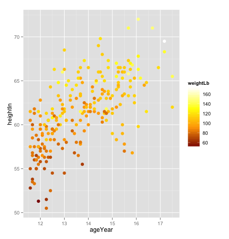
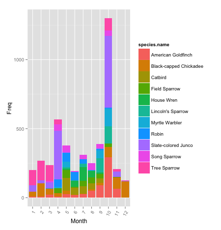
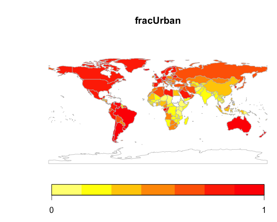
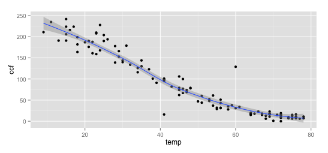
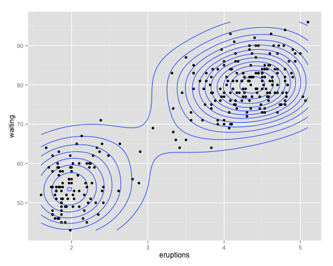
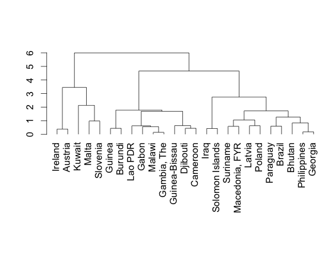

```{r echo=FALSE}
gitHTML=function(label="Description",nm,folder){
  paste("[",label,"](http://htmlpreview.github.com/?https://github.com/dtkaplan/DataAndComputingFundamentals/blob/master/",folder,nm,".html)", sep="")
}
template=function(label="Rmd Template",nm,folder){
  paste("[",label,"](https://raw.github.com/dtkaplan/DataAndComputingFundamentals/master/",folder,nm,".Rmd)", sep="")
}

handin=function(name){
  paste("[Moodle link](https://moodle.macalester.edu/mod/assign/view.php?id=",Handin[[name]],")",sep="")
}
Handin=list()
Handin$W1syntax=17814 
Handin$W1country=17816
Handin$W1body=17815
Handin$W1web=18513
```

Syllabus 
================
### Data and Computing Fundamentals `r I(gitHTML(".",nm="syllabus2013", folder="Spring2013/"))`
### Spring 2013

#### Danny Kaplan and Libby Shoop, instructors

To update the DCF software: copy and paste these commands into your R console.
```{r eval=FALSE}
require(devtools) 
install_url("http://mosaic-web.org/go/Repository/DannyKaplan/DCF_0.11.tar.gz")
require(DCF)
```

### Resources

#### Software

**R and RStudio**.  You will likely find it convenient to have an account on the <www.macalester.edu/rstudio> server.  If you don't already have one, you can [request one here](https://docs.google.com/a/macalester.edu/spreadsheet/viewform?formkey=dHJWYnlzdU10ZkFQRjRXcjhobWRORGc6MQ#gid=0).

**RPubs**: a site for distributing documents on the web.  You'll hand in documents by cutting-and-pasting the URL into Moodle.  
* HELP: A student volunteer is needed to make a video demonstrating this.

**R Markdown** Introduction Template

**R Syntax** Introduction Video

**R Chunks in R Markdown** Introduction 

**Making Graphics**
* Scatter plots
* Bar plots

---------------

### Week 1



#### Topics: 
* Welcome `r I(gitHTML("Notes",nm="Day-1",folder="Notes/Day1/"))`
* Introduction to R and R/Markdown
* The structure of data tables
* Scatter plots

#### In-Class
* R Syntax
* Country-by-country size and population data

#### Out-of-Class
* Body shape and diabetes

#### To Hand in
Topic | Instructions | Template | Hand in on Moodle
------|--------------|----------|-------------------
Exercises on syntax |  `r I(gitHTML(nm="syntax-exercises", folder="Notes/Day1/"))` | `r I(template(nm="syntax-exercises",folder="Notes/Day1/"))` | `r I(handin("W1syntax"))`
Country data on the web | `r I(gitHTML(nm="Data-on-the-web", folder="Notes/Day1/"))` | |   `r I(handin("W1web"))` 
Country-by-country data | `r I(gitHTML(nm="in-class-activity", folder="Notes/Day1/"))` | `r I(template(nm="UNFAO-week1",folder="Templates/"))` | `r I(handin("W1country"))` 
Body shape data | `r I(gitHTML(nm="body-shape", folder="Notes/Day1/"))` | `r I(template(nm="body-shape-template",folder="Notes/Day1/"))` | `r I(handin("W1body"))` 

----------------


### Week 2



### Topics
* Groupwise analysis

#### To Hand in

Topic | Instructions | Template | Hand in on Moodle
------|--------------|----------|------------------

### Week 3



### Topics
* Joining tables together

#### To Hand in

Topic | Instructions | Template | Hand in on Moodle
------|--------------|----------|------------------

### Week 4



#### Topics
* Model functions and fitting

#### To Hand in

Topic | Instructions | Template | Hand in on Moodle
------|--------------|----------|------------------


----------
### Week 5



#### Topics 
* Density and clustering

#### To Hand in

Topic | Instructions | Template | Hand in on Moodle
------|--------------|----------|------------------

----------
### Week 6



#### Topics
* Classification & dimension reduction

#### To Hand in

Topic | Instructions | Template | Hand in on Moodle
------|--------------|----------|------------------

----------
### Week 7


#### Topics
* Wrapping things up!

#### To Hand in

Topic | Instructions | Template | Hand in on Moodle
------|--------------|----------|------------------
